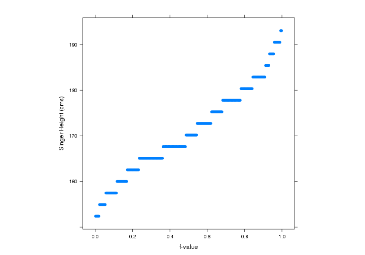
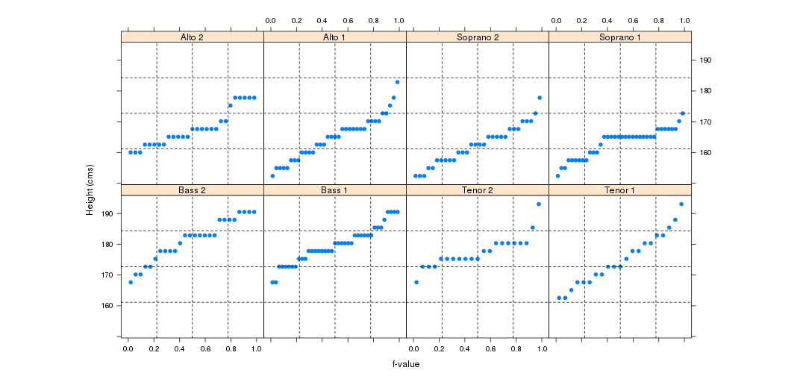
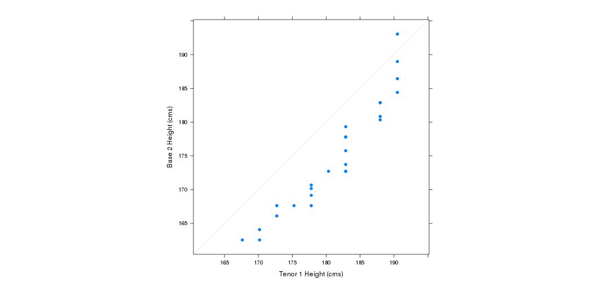
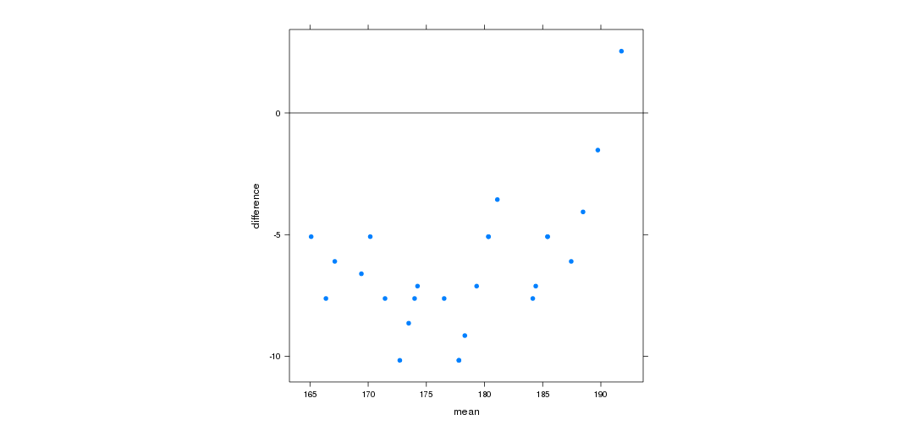
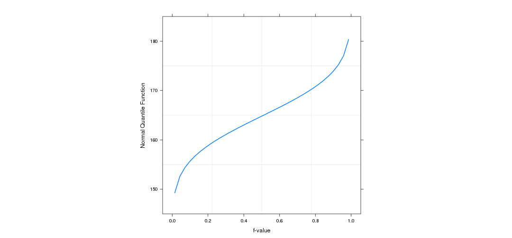

Le quartet d'Anscombe
---------------------

``` 
Moyenne  des x : 9.0  ~~   [mean(x)]  
Variance des x : 11   ~~     [var(x)]
Moyenne  des y : 7.50
Variance des y : 4.12
Corrélation entre x e y : 0.816  ~~ [ cor(x, y) ou cor(data) ]
Régression linéaire : y = 3 + 0.5 x  ~~ [ lm(y~x, data) ]
```
Les mêmes valeurs de résumé ==> les mêmes données 

---


```r
par(mfcol = c(2, 2), mai = c(0.3, 0.3, 0.3, 0.3))
plot(quartet$x1, quartet$y1, pch = 19, panel.last = abline(lm(y1 ~ x1, data = quartet)))
plot(quartet$x2, quartet$y2, pch = 19, panel.last = abline(lm(y2 ~ x2, data = quartet)))
plot(quartet$x3, quartet$y3, pch = 19, panel.last = abline(lm(y3 ~ x3, data = quartet)))
plot(quartet$x4, quartet$y4, pch = 19, panel.last = abline(lm(y4 ~ x4, data = quartet)))
```


---

Ex 2. Les données barley
---------------------


---
## Plan

1. Données univariées
2. Données bivariées
3. Données trivariées 
4. Données hypervariées


#### Biblio

**Visualizing Data** (1993) William S. Cleveland [codes & data](http://www.stat.purdue.edu/~wsc/visualizing.html)

--- .class #id 

## Diagrammes à tiges et à feuilles


---

## 1. Données univariées 


```r
dim(singer)
```

```
## [1] 235   2
```

```r
head(singer)
```

```
##   height voice.part
## 1     64  Soprano 1
## 2     62  Soprano 1
## 3     66  Soprano 1
## 4     65  Soprano 1
## 5     60  Soprano 1
## 6     61  Soprano 1
```


---


```r
boxplot(2.54 * singer$height, horizontal = TRUE)
```

 


---

```r
stem(2.54 * singer$height, scale = 0.8)
```

```
## 
##   The decimal point is 1 digit(s) to the right of the |
## 
##   15 | 22222
##   15 | 5555555577777777777777
##   16 | 0000000000000333333333333333
##   16 | 55555555555555555555555555555588888888888888888888888888888
##   17 | 00000000000000333333333333333333
##   17 | 5555555555555588888888888888888888888
##   18 | 0000000000000003333333333333333
##   18 | 55555888888
##   19 | 1111111133
```


--- 

## 1. Données univariées : q-plot

Le quantile $x_f$ d'une variable aléatoire $X$ est $x_f = \lbrace \inf x : F(x) \leq f \rbrace$ où $F$ est la fonction de répartition de $X$.

Pour un échantillon `$X_1, \ldots, X_n$` de $X$ la fonction de répartition empirique est 
`\[
   \hat F_n(x) = \sum_{j=1}^n I_{\{X_j \leq x\}}
\]`.
Alors, la version empirique de $x_f$ on la note $q(f)$.
* Grâce au Théorème de Glivenko-Cantelli, on sait que `$\sup_x \|\hat F_n(x) - F(x)\| \mapsto 0$` donc les quantiles empiriques sont une estimation raisonnable des quantiles théoriques.

---

#### Construction des $q(f)$

Soit 
* `$X_{(j)}, j= 1, \ldots, X_{(n)}$` l'échantillon ordonné, i.e. 
`$X_{(1)} \leq X_{(2)} \leq \ldots \leq X_{(n)}$`.
* les quantités discrètes $f_j = \frac{j - 0.5}{n}$ pour $j=1, \ldots, n$.

Alors, 
* on considère `$q(f_j) = X_{(j)}}$` 
* les restantes valeurs de la courbe $q(f)$ sont obtenus par interpolation linéaire.

#### q-plot

C'est la réprésentation de $x_{(j)}$ en fonction de $f$.

---




---




---

## 1. Données univariées : qq-plot 

* 2 ensembles des données univariées: 
 * `$X_1, \ldots, X_n$`
 * `$Y_1, \ldots, X_m$`
* Si 
 * $m = n$ alors les $f_j$ sont obtenues comme avant
 * $m \le n$ alors on obtient les $f_j$ sur $Y$ et pour $X$ on interpole.

Pour le diagramme quantile-quantile on répresente les quantiles d'une de variables en fonction des quantiles de l'autre. 

---




---

## 1. Données univariées :  m-d plot




---

## 1. Données univariées :  qq plots


---


---




---


